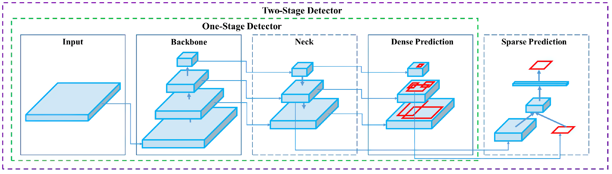

This repository contains Projectwork :arrow_down: undertaken for the partial fulfillment of Advanced Deep Learning Module ( SS2021 ) and ETCS Creditpoints @OpenCampus.sh.

# Open-Detector

**Objective :**  Real-Time Object Detection using OpenCV, YOLO, and PyTorch [ #needsupdate ]

## :beginner: Index

1. Datasets

2. Implementation

3. References

## :diamond_shape_with_a_dot_inside: 1. Dataset

- MSCOCO 2017 Dataset [[ Pretrained - Darknet ](https://github.com/AlexeyAB/darknet)]

## :computer: 2. Implementaition

**Status /Progress**

- [ ] Exploration of Datasets

- [ ] Exploartion of Application Domain and Challenges

- [ ] Exploration of Architectures

- [ ] Image Processing and Data Loaders

- [ ] Implementation-OpenCV [CPU]
    - [ ] YOLOv3 pre-trained inference on videos/webcam
    - [ ] YOLOv4 pre-trained inference on videos/webcam

- [ ] OpenCV with CUDA ( build and install)

- [ ] Implementation PyTorch
  - [ ] 

## :bookmark_tabs: 3. References

- [1. ] YOLO Versions : [[Scaled-v4 Feb 2021](https://arxiv.org/pdf/2011.08036.pdf)], [[V4 Apr 2020](https://arxiv.org/pdf/2004.10934v1.pdf)], [[V3 Apr 2018](https://arxiv.org/pdf/1804.02767v1.pdf)], [[V2 Dec 2016](https://arxiv.org/pdf/1612.08242v1.pdf)], & [[V1 May 2016](https://arxiv.org/pdf/1506.02640v5.pdf)]
- [2. ]
